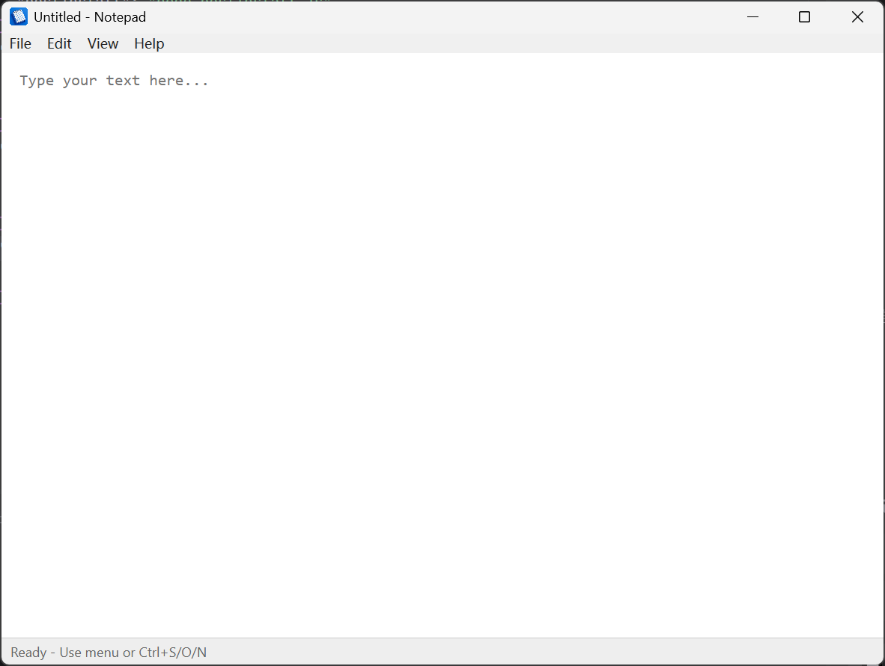
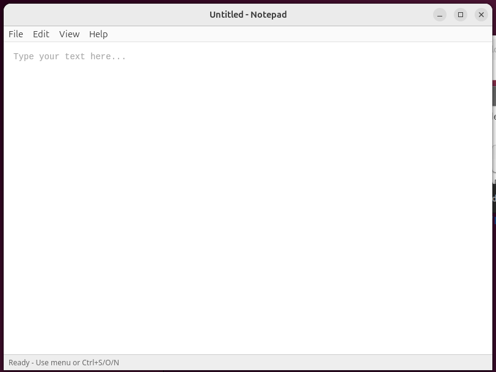

# Node with Window

> ⚠️ Alpha — expect breaking changes.

A cross-platform windowing library for Node.js with an Electron-compatible API.
Uses WPF + WebView2 on Windows and GTK 4 + WebKitGTK on Linux.





## Install

```bash
npm install @devscholar/node-with-window
```

On Windows, also download the WebView2 SDK DLLs:

```bash
node node_modules/@devscholar/node-with-window/scripts/webview2-install.js install
```

## Quick start

Use [nww-forge](https://www.npmjs.com/package/@devscholar/nww-forge) to scaffold a new app:

```bash
npx @devscholar/nww-forge init my-app
cd my-app
npm start
```

See [docs/quick-start.md](./docs/quick-start.md) for a step-by-step guide.

## Prerequisites

### Windows

- Node.js 18+
- PowerShell 5.1
- .NET Framework 4.8
- **WebView2 runtime** (pre-installed on Windows 11; install from [Microsoft](https://developer.microsoft.com/en-us/microsoft-edge/webview2/) on Windows 10)

### Linux

- Node.js 18+
- GJS (GNOME JavaScript runtime)
- GTK 4
- WebKitGTK 6.0

These are typically pre-installed on Ubuntu 24.04 LTS / GNOME desktops. If missing:

```bash
sudo apt install gjs gir1.2-gtk-4.0 gir1.2-webkit-6.0
```

#### WebKit sandbox in virtual machines

When running inside a VMware (or similar) virtual machine, WebKitGTK's bubblewrap
sandbox may fail with `Permission denied` because the VM kernel restricts
unprivileged user namespaces:

```
bwrap: setting up uid map: Permission denied
Failed to fully launch dbus-proxy
```

`node-with-window` detects VMware at startup by reading `/sys/class/dmi/id/sys_vendor`.
When running inside VMware, `WEBKIT_DISABLE_SANDBOX_THIS_IS_DANGEROUS=1` is set
automatically when spawning the GJS host, suppressing this error.
On bare-metal or other hypervisors the WebKit sandbox runs normally.
If you hit this error in another environment (e.g. a container or a different VM),
enable user namespaces instead:

```bash
sudo sysctl -w kernel.unprivileged_userns_clone=1
# To persist across reboots:
echo 'kernel.unprivileged_userns_clone=1' | sudo tee /etc/sysctl.d/99-userns.conf
```

## API

The API mirrors [Electron](https://www.electronjs.org/docs/latest/) — replace
`import ... from 'electron'` with `import ... from '@devscholar/node-with-window'`.

Both `app.on('ready', cb)` and `await app.whenReady()` are supported, just like Electron.

## Examples

See [node-with-window-examples](https://github.com/devscholar/node-with-window-examples).

## How it works

### Windows (WPF + WebView2)

- `node-with-window` spawns `scripts/backend/netfx-wpf/WinHost.ps1` as a child process. The script compiles the WPF/WebView2 C# bridge (`scripts/backend/netfx-wpf/*.cs`) at startup via PowerShell's `Add-Type` and communicates over a Windows Named Pipe using a synchronous JSON request/response protocol.
- `show()` sends a `StartApplication` command to the .NET host, which immediately acknowledges and then calls `Application.Run(window)` — blocking the .NET thread in the WPF message loop without blocking the Node.js event loop.
- Node.js polls for events every 16 ms with a `Poll` command that drains a thread-safe queue. WPF event handlers (like `WebMessageReceived`) enqueue their payload instead of blocking on synchronous IPC, so `async ipcMain.handle()` callbacks work normally.
- When `loadFile` is called before `show()`, the file path is queued. After `Application.Run()` starts and CoreWebView2 finishes initializing, the bridge script is registered via `AddScriptToExecuteOnDocumentCreatedAsync` and WebView2 navigates to the `file:///` URI directly.
- Node integration uses a loopback HTTP server started in the main process; the renderer calls `window.require(module)` via synchronous XHR. Callbacks are delivered via a persistent `EventSource`.

### Linux (GJS + GTK 4 + WebKitGTK)

- `GjsGtk4Window` spawns `scripts/backend/gjs-gtk4/host.js` as a child process via GJS.
  The host script runs the GTK 4 main loop (`GLib.MainLoop`) and owns the `Gtk.Window` + `WebKit.WebView`.
- Node.js and the GJS host communicate over two Unix FIFOs (passed as fd 3 and fd 4) using
  a synchronous newline-delimited JSON request/response protocol.
- **WebKit → Node.js IPC:** the HTML renderer posts messages via
  `window.webkit.messageHandlers.ipc.postMessage(json)`. The GJS host queues them.
  Node.js drains the queue every 16 ms with a `Poll` command.
- **Window closed:** the GJS host sends `type: 'exit'`; Node.js calls `onClosed()`, which bubbles
  up to `BrowserWindow` and triggers `process.exit(0)` when no other windows remain open.
- **Node.js → WebKit IPC:** replies and push messages are delivered by sending a
  `SendToRenderer` command, which calls `webView.evaluate_javascript()` in GJS.
- Async `ipcMain.handle()` handlers are fully supported (the Node.js event loop stays alive
  between polls).

## Developing

After making changes to `node-with-window` itself, rebuild:

```bash
cd node-with-window && npm run build
```
